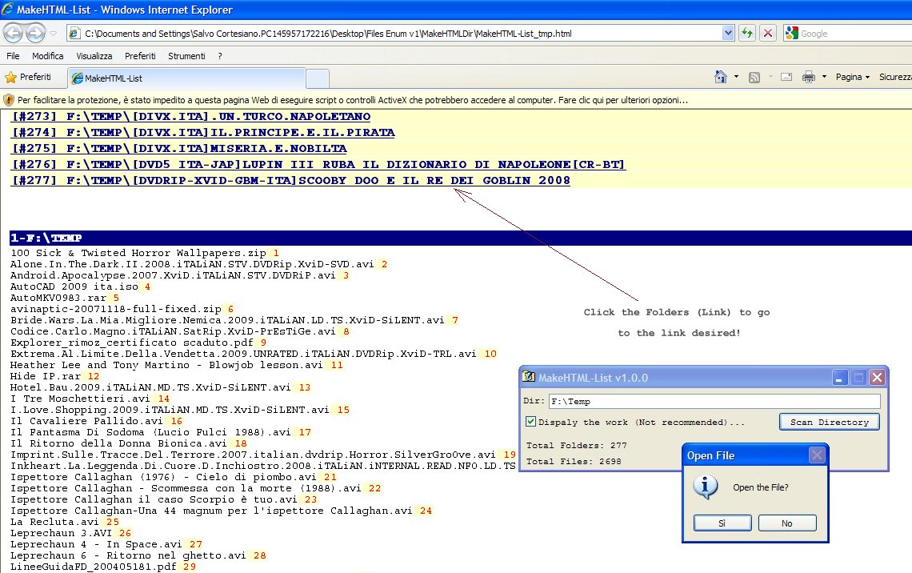



## Scan all Folders or Dir and put \(create\) the list into HTML or PDF file \(Update\)

### Description

Example how scan a Directory's and the relevant sub-directorie's, and create the list of file's in a HTML or PDF file that contains the list of folder's (link) with clickable links!

Note: Clickable links not implemented in PDF File!
 
### More Info
 
Option Explicit

' .... Init PDF Class

Private myPDF As New clsPDF

' .... Int Count lines

Private totPDFPage As Integer

' .... Limit Line for PDF Page

Private strLine As Integer ' .... Default = 59

' .... STOP the recursive Scan Dir

Private STOP_PRESSED As Boolean

' .... to Strip a Dir

Private Const gstrNULL$ = ""

Private Const gstrSpace$ = " "

Private Const gstrSEP_DIR$ = "\"

Private Const gstrSEP_DIRALT$ = "/"

Private Const gstrSEP_EXT$ = "."

Private Const gstrCOLON$ = ":"

Private Const gstrSwitchPrefix1 = "-"

Private Const gstrSwitchPrefix2 = "/"

Private Const gstrCOMMA$ = ","

' .... Function Shell files

Private Declare Function ShellExecute Lib "Shell32.dll" Alias "ShellExecuteA" (ByVal hwnd As Long, ByVal lpOperation As String, ByVal lpFile As String, ByVal lpParameters As String, ByVal lpDirectory As String, ByVal nShowCmd As Long) As Long

' .... Constant

Private Const SW_SHOWNORMAL = 1

             |
---                |---
**Submitted On**   |2009-03-04 06:20:22
**By**             |[Salvo Cortesiano \(Italy\)](https://github.com/Planet-Source-Code/PSCIndex/blob/master/ByAuthor/salvo-cortesiano-italy.md)
**Level**          |Intermediate
**User Rating**    |5.0 (10 globes from 2 users)
**Compatibility**  |VB 5\.0, VB 6\.0
**Category**       |[Files/ File Controls/ Input/ Output](https://github.com/Planet-Source-Code/PSCIndex/blob/master/ByCategory/files-file-controls-input-output__1-3.md)
**World**          |[Visual Basic](https://github.com/Planet-Source-Code/PSCIndex/blob/master/ByWorld/visual-basic.md)
**Archive File**   |[Scan\_all\_F2146633112009\.zip](https://github.com/Planet-Source-Code/salvo-cortesiano-italy-scan-all-folders-or-dir-and-put-create-the-list-into-html-or-pdf-fi__1-71831/archive/master.zip)

